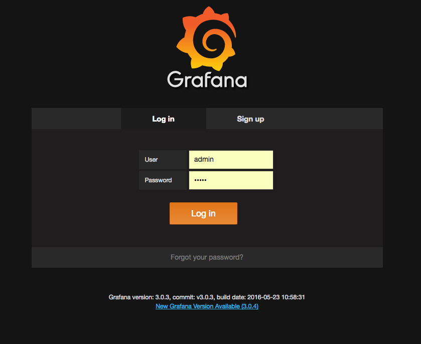
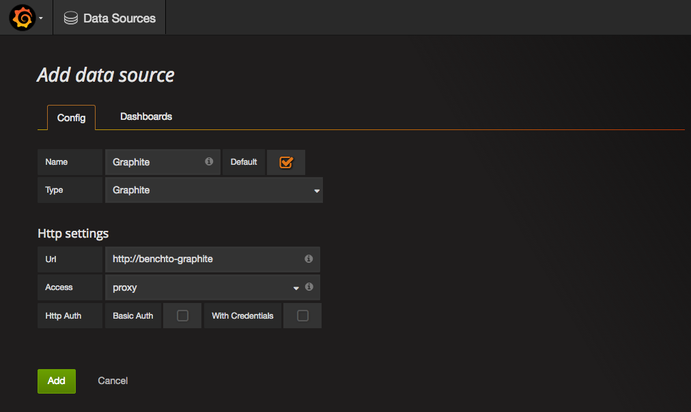

# Getting Started

This document describes how to set up and start Benchto on local machine.

## Prerequisites

* Docker >= 1.8
* Maven 3
* JDK 17

## Note on docker-machine

The urls in this tutorial, for services exposed from docker containers, use `dockerhost` as hostname.

If you use [docker-machine](https://docs.docker.com/machine/overview/), use IP of docker machine as `dockerhost`. Docker machine IP can be obtained using:
```
$ docker-machine ip
```
or
```
$ docker-machine ip name_of_your_docker_machine
```

If you are running docker container on the same machine, on which docker client is used, use `127.0.0.1` as `dockerhost`.

The easiest way is to set up correct mapping in `/etc/hosts`.

## Build project

```
mvn clean install package -P docker-images
```

## Starting up Trino

```sh
docker run --name trino \
    -p 8080 \
    -d \
    trinodb/trino:latest
```

## Starting up auxiliary services

Postgres, Graphite and Grafana (all available as docker images) are required by Benchto service.
Those services are used to store benchmark results and store and visualize cluster performance.

To run those as docker container execute following statements:

```
docker run --name benchto-postgres \
       -e POSTGRES_PASSWORD=postgres \
       -p 5432:5432 -d postgres

docker run --name benchto-graphite \
       -p 2003:2003 -p 18088:80 \
       -d hopsoft/graphite-statsd

docker run --name benchto-grafana \
       --link benchto-graphite:benchto-graphite \
       -p 3000:3000 -d grafana/grafana
```

Grafana web interface is available at: [http://dockerhost:3000/](http://dockerhost:3000/).

## Setup collectd monitoring agent on localhost

Collectd is used to measure performance of cluster nodes and push results to Graphite.
For testing purposes callectd will be setup on as docker container exposing stats of `hadoop-master`.
In real world setups collectd would be installed on each node of the cluster.

```
docker run --name benchto-collectd-docker --link benchto-graphite:benchto-graphite \
              -d -v /var/run/docker.sock:/var/run/docker.sock \
              -e GRAPHITE_HOST=benchto-graphite -e COLLECTD_HOST=benchto \
              bobrik/collectd-docker
```

## Configure Grafana dashboard

In order to view performance metrics in Grafana you have to setup
data source (Graphite) and dashboard. We have created an example
dashboard that will show CPU, network and memory performance from localhost.

Log into [Grafana](http://dockerhost:3000/) (user: ``admin``, password: ``admin``)



Navigate to ``Data Sources->Add data source`` and add Graphite data source as follows:



Navigate to ``Dashboard->Home`` and import dashboard from ``docs/getting-started/dashboard-grafana.json``


You should now see the Dashboard.

Click ``Save dashboard`` icon.


## Start benchto

Now, let's start the benchmark service itself. The Benchmark service is responsible
for storing and displaying benchmark results.

```
docker run --name benchto-service --link benchto-postgres:benchto-postgres \
        -e SPRING_DATASOURCE_URL=jdbc:postgresql://benchto-postgres:5432/postgres \
        -e SPRING_DATASOURCE_USERNAME=postgres \
        -e SPRING_DATASOURCE_PASSWORD=postgres \
        -p 8080:8080 -d trinodev/benchto-service
```

Verify that the benchmark service works: [http://dockerhost:8080/#/](http://dockerhost:8080/#/)
You should see page similar to this:


## Creating environment

We also need to register a Benchto environment. Environments are
used in a multi-cluster setup, where each cluster has a separate
environment assigned.

```
curl -X POST -H 'Content-Type: application/json' -d '{
    "dashboardType": "grafana",
    "dashboardURL": "http://dockerhost:3000/dashboard/db/demo"
}' http://dockerhost:8080/v1/environment/DEMO
```

No you can visit environment page: [http://dockerhost:8080/#/DEMO](http://dockerhost:8080/#/DEMO)

## Running benchmark

In order to run benchmarks you have to start Benchto agent with appropriate parameters.
The preferred way to do this (especially when you have classpath dependencies like JDBC jars)
is by creating a maven project that launches the agent. An example of such project is
in `benchto-getting-started` directory. Benchmarks and SQL queries are located in
`src/main/resource/benchmarks` and `src/main/resource/sql` directories. The POM defines
`exec:java` task that launches the Benchto agent which runs benchmarks. You can used
this file as a template for your benchmarking projects. For more information about
benchmark agent look at `benchto-driver/README.md`.

Launch an example benchmark by running following commands:

```
cd docs/getting-started/tests
mvn package exec:java -Ddep.benchto-driver.version=0.19-SNAPSHOT
```
Or if you do not setup mapping for `dockerhost` in `/etc/hosts` pass ip address as environment variable
```
cd docs/getting-started/tests
dockerhost=IP_OF_DOCKER_HOST mvn package exec:java -Ddep.benchto-driver.version=0.19-SNAPSHOT

```

The progress and results are visible on benchto page: [http://dockerhost:8080/#/](http://dockerhost:8080/#/DEMO)

