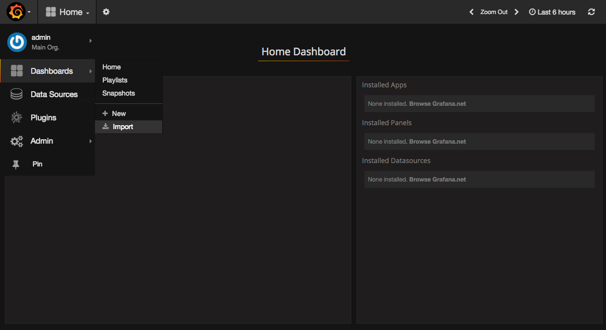
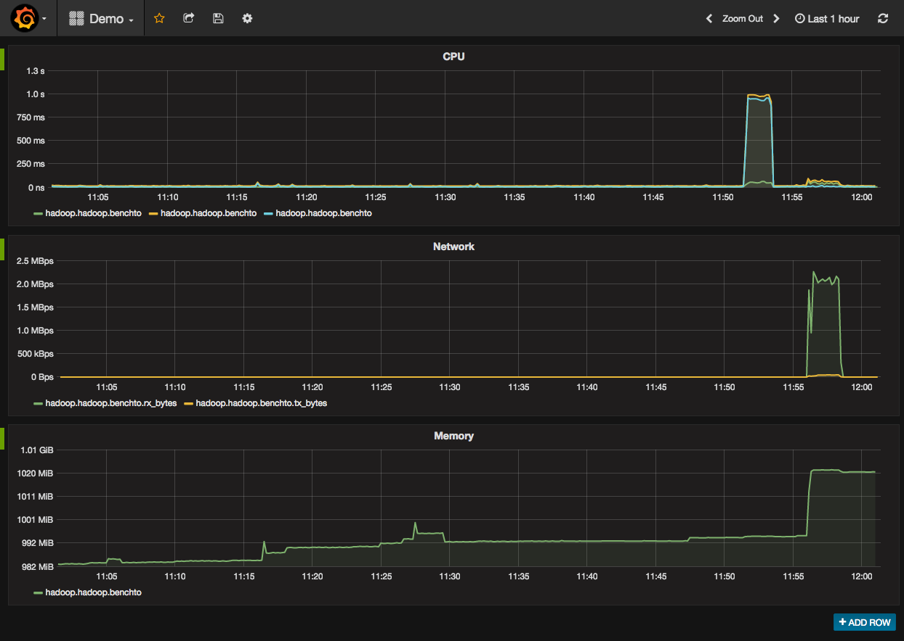

# Getting Started

This document describes how to setup and start Benchto on local machine.

## Prerequisites

* Docker >= 1.8
* Maven 3
* JDK 8

## Starting up local Hadoop in docker environment.

We will be using Hadoop CDH5 docker image which is available [here](https://hub.docker.com/r/hswarm/cdh5-hive/).
In order to start the Hadoop on your local machine run the following command:

```
docker run -d --name hadoop-master -h hadoop-master \
       -p 50070:50070 -p 10000:10000 -p 19888:19888 \
       hswarm/cdh5-hive
```

This will start a docker container with HDFS, Yarn and Hive running.
You can check if the services are up by visiting following pages:
* HDFS: [http://localhost:50070/dfshealth.html#tab-overview](http://localhost:50070/dfshealth.html#tab-overview)
* Job history: [http://localhost:19888/jobhistory](http://localhost:19888/jobhistory)

## Generate data

In order to run benchmarks you have to have data stored in HDFS. We have created a generator that
easies process of generating test data of various types and formats. You can learn more about generator
by reading README file at `benchto-generator/README.md`. For the purpose of this tutorial we will
create 4 ORC files with 1 million of random bigint rows in total. To do so build and install the project:

```
mvn install
```

Copy the generator jar to hadoop container:

```
$ docker cp benchto-generator/target/benchto-generator-1.0.0-SNAPSHOT.jar \
            hadoop-master:/tmp

Run the generator:

$ docker exec -it hadoop-master su hdfs -c "hadoop jar /tmp/benchto-generator-1.0.0-SNAPSHOT.jar orc bigint 1000000 4"
15/09/22 14:30:16 INFO generator.HiveTypesGenerator: Generating 1000000 bigints, directory: /benchmarks/benchto/types/orc-bigint/1000000, number of files: 4
15/09/22 14:30:17 INFO client.RMProxy: Connecting to ResourceManager at /0.0.0.0:8032
15/09/22 14:30:17 WARN mapreduce.JobSubmitter: Hadoop command-line option parsing not performed. Implement the Tool interface and execute your application with ToolRunner to remedy this.
15/09/22 14:30:18 INFO mapreduce.JobSubmitter: number of splits:4
15/09/22 14:30:18 INFO mapreduce.JobSubmitter: Submitting tokens for job: job_1442915754438_0003
15/09/22 14:30:18 INFO impl.YarnClientImpl: Submitted application application_1442915754438_0003
15/09/22 14:30:18 INFO mapreduce.Job: The url to track the job: http://hadoop-master:8088/proxy/application_1442915754438_0003/
15/09/22 14:30:18 INFO mapreduce.Job: Running job: job_1442915754438_0003
15/09/22 14:30:25 INFO mapreduce.Job: Job job_1442915754438_0003 running in uber mode : false
15/09/22 14:30:25 INFO mapreduce.Job:  map 0% reduce 0%
...

You also have to create Hive tables for the generated data:

$ docker exec -it hadoop-master su hdfs -c hive
hive> CREATE DATABASE types_1m_orc;
OK
Time taken: 0.731 seconds
hive> CREATE EXTERNAL TABLE types_1m_orc.bigint (value BIGINT)
      STORED AS ORC LOCATION '/benchmarks/benchto/types/orc-bigint/1000000';
OK
Time taken: 0.123 seconds
hive> SELECT * FROM types_1m_orc.bigint LIMIT 5;
OK
-6017053221777323554
7560605494531223593
8986743430403204777
-6546720071958952640
-3838344460853028972
Time taken: 0.357 seconds, Fetched: 5 row(s)
```

## Starting up auxiliary services in docker environment

Postgres, Graphite and Grafana (all available as docker images) are also required by Benchto service.
Those services are used to store benchmark results and store and visualize cluster performance.

```
docker run --name benchto-postgres \
       -e POSTGRES_PASSWORD=postgres \
       -p 5432:5432 -d postgres
docker run --name benchto-graphite \
       -p 2003:2003 -p 8088:80 \
       -d hopsoft/graphite-statsd
docker run --name benchto-grafana \
       --link benchto-graphite:benchto-graphite \
       -p 3000:3000 -d grafana/grafana
```

Grafana web interface is available at: [http://localhost:3000/](http://localhost:3000/)

## Setup collectd monitoring agent on localhost

Collectd is used to measure performance of cluster nodes and push results to Graphite.
For testing purposes callectd will be setup on `localhost`. In real world setups collectd
would be installed on each node of the cluster. In order to install collectd on
you machine run the following commands:

```
wget https://collectd.org/files/collectd-5.5.0.tar.gz
tar xvzf collectd-5.5.0.tar.gz
cd collectd-5.5.0
make
sudo make install
```

Set `/opt/collectd/etc/collectd.conf` configuration as following:

```
Hostname "localhost"

FQDNLookup   false
Interval     10
LoadPlugin syslog
LoadPlugin cpu
LoadPlugin interface
LoadPlugin load
LoadPlugin memory
LoadPlugin write_graphite

<Plugin cpu>
  ReportByCpu false
  ReportByState true
  ValuesPercentage true
</Plugin>

<Plugin interface>
        Interface "lo"
        IgnoreSelected true
</Plugin>

<Plugin memory>
        ValuesAbsolute true
</Plugin>

<Plugin write_graphite>
  <Carbon>
    Host "localhost"
    Port "2003"
    Protocol "tcp"
    Prefix "collectd."
    StoreRates true
    AlwaysAppendDS true
    EscapeCharacter "_"
  </Carbon>
</Plugin>
```

Start the collectd daemon:

```
sudo /opt/collectd/sbin/collectd
```

## Configure Grafana dashboard

In order to view performance metrics in Grafana you have to setup
data source (Graphite) and dashboard. We have created an example
dashboard that will show CPU, network and memory performance from localhost.

1. Log into [Grafana](http://localhost:3000/) (user: ``admin``, password: ``admin``)


2. Navigate to ``Data Sources->Add New`` and add Graphite data source as follows:


3. Navigate to ``Dashboard->Home`` and import dashboard from ``docs/getting-started/dashboard-grafana.json``



4. You should now see the Dashboard. Click ``Save dashboard`` icon.


## Start benchto

Now, let's start the benchmark service itself. The Benchmark service is responsible
for storing and displaying benchmark results.

```
docker run --name benchto-service --link benchto-postgres:benchto-postgres \
        -e "SPRING_DATASOURCE_URL=jdbc:postgresql://benchto-postgres:5432/postgres" \
        -p 8080:8080 -d hswarm/benchto-service
```

Verify that the benchmark service works: [http://localhost:8080/#/](http://localhost:8080/#/)
You should see page similar to this:


## Creating environment

We also need to register a Benchto environment. Environments are
used in a multi-cluster setup, where each cluster has a separate
environment assigned.

```
curl -X POST -H 'Content-Type: application/json' -d '{
    "dashboardType": "grafana",
    "dashboardURL": "http://localhost:3000/dashboard/db/demo"
}' http://localhost:8080/v1/environment/DEMO
```

You should be able to verify the environment: [http://localhost:8080/#/environment/DEMO](http://localhost:8080/#/environment/DEMO)

## Running benchmark

In order to run benchmarks you have to start Benchto agent with appropriate parameters.
The preferred way to do this (especially when you have classpath dependencies like JDBC jars)
is by creating a maven project that launches the agent. An example of such project is
in `benchto-getting-started` directory. Benchmarks and SQL queries are located in
`src/main/resource/benchmarks` and `src/main/resource/sql` directories. The POM defines
`exec:java` task that launches the Benchto agent which runs benchmarks. You can used
this file as a template for your benchmarking projects. For more information about
benchmark agent look at `benchto-driver/README.md`.

Launch an example benchmark by running following commands:

```
cd benchto-getting-started
mvn package exec:java
```

The progress and results are visible on benchto page: [http://localhost:8080/#/](http://localhost:8080/#/)

